**Prior Art**:

-   <https://www.sciencedirect.com/science/article/pii/S1877050922005701>
-   <https://www.bittware.com/resources/cnn/>
-   https://www.mdpi.com/2079-9292/10/22/2859
-   <https://github.com/ZFTurbo/Verilog-Generator-of-Neural-Net-Digit-Detector-for-FPGA/tree/master>
-   <https://github.com/AniketBadhan/Convolutional-Neural-Network>
-   <https://github.com/AniketBadhan/Convolutional-Neural-Network/tree/master>

**Github Repository**: <https://git.ucsc.edu/snaray17/nn>

**Introduction**:

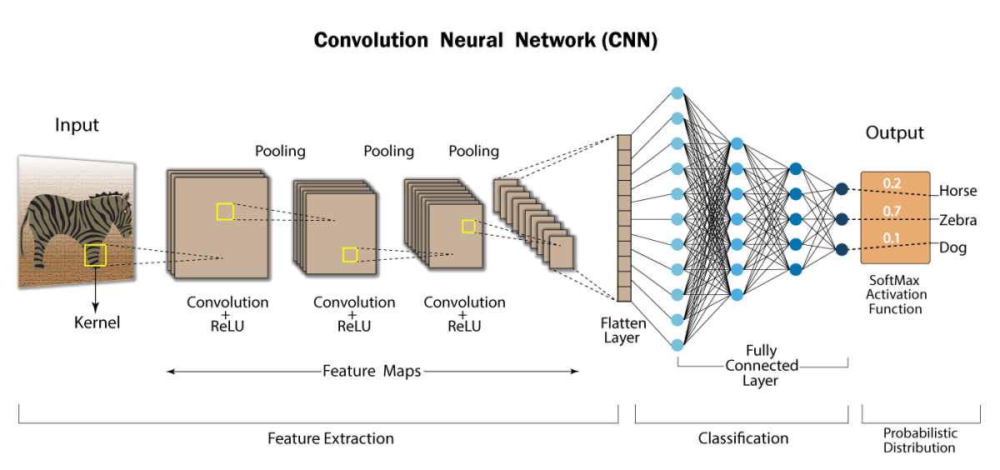

The convolution layer is one of the ways that computers can comprehend the image domain; the network is initially trained offline using GPU and the corresponding weights are transported to hardware for inference. It carries the main portion of the network’s computational load.

This layer performs a dot product between two matrices, where one matrix is the set of learnable parameters otherwise known as a kernel, and the other matrix is the restricted portion of the receptive field. The kernel is spatially smaller than an image but is more in-depth. This means that, if the image is composed of three (RGB) channels, the kernel height and width will be spatially small, but the depth extends up to all three channels.

In the prior art search, I observed that most of the implementations were available for dense “Fully-Connected Layers”(FC) whilst not many focused on CNN as they are quite intensive and quite math intensive to compute. In order to bridge this gap, the below CNN, Pooling, and ReLU implementations are made.

**Implementation**:

Initially, a python ground truth model is created so as to observe any deviations that might occur during implementation. All the notebooks and python scripts are available in the GitHub repository.

The jupyter-notebook contains an entire neural network implemented from scratch in pure python without any library support. This acts as a golden model(reference), in which we compare our results from our verilog implementation.

What has been implemented and verified:

-   Universal Convolutional Neural Layer (INT/ Quantized Float)
-   Universal Pooling Layer (INT/ Quantized Float)
-   ReLU Activation (INT/ Quantized Float)

**NOTE: All the implementations are built to support parameterised values; this can support image and kernels of any size. Also, the modules were initially built on INT values and then the (Float 16bit) float quantization support was introduced.**

**Future Scopes**:

-   Create a block IP and interface it with PYNQ board and jupyter-notebook
-   Build Linear Layers(Fully Connected Layers)
-   Fusion of CNN and Linear layers
-   Built a complete pipelined NN
-   Support of Bias in CNN and FC
-   Make an End-to-End Inference Engine

**Convolution Neural Network**:

Image Source: [simplilearn.io](http://simplilearn.io)

**Maxpool**:

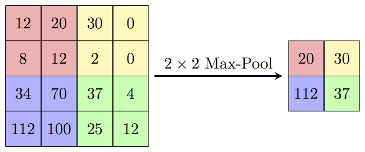

**Ground Truth Model Inferred from the Python Notebook:**

**INT16 Version**

**Kernel**:

[ [ 0 1 2]

[ 3 4 5]

[ 6 7 8] ]

**Image**:

[ [ 0 1 2 3]

[ 4 5 6 7]

[ 8 9 10 11]

[12 13 14 15] ]

**Output**:

[ [ 258 294]

[ 402 438] ]

**Float16 Version**

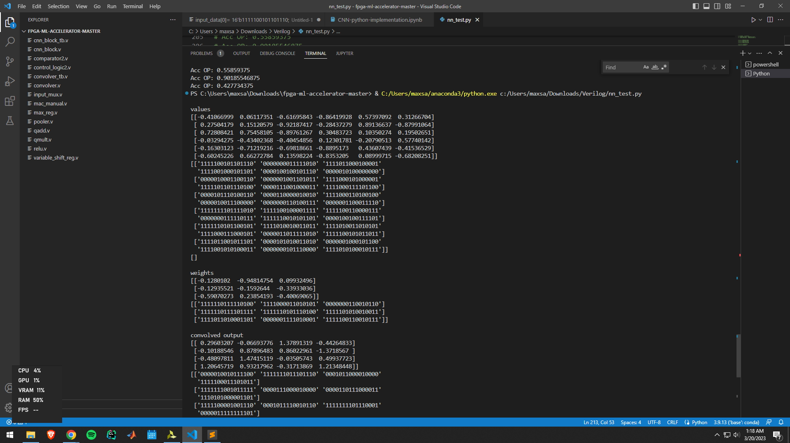

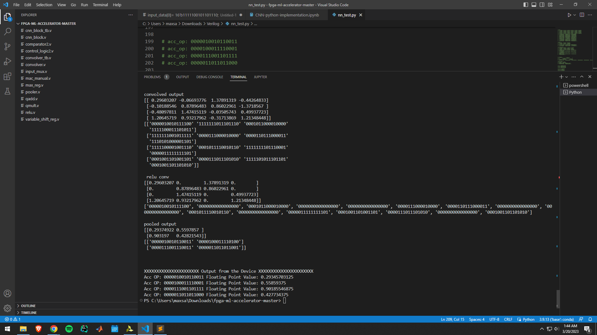

**INT16 Implementation**

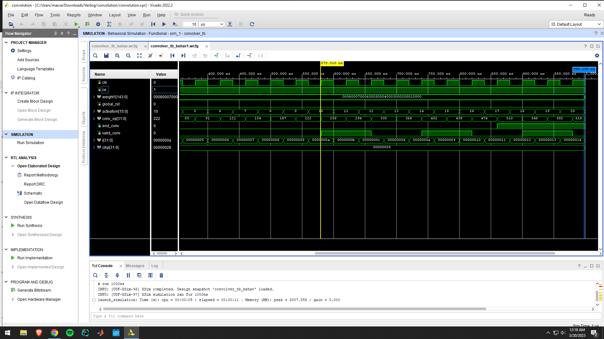

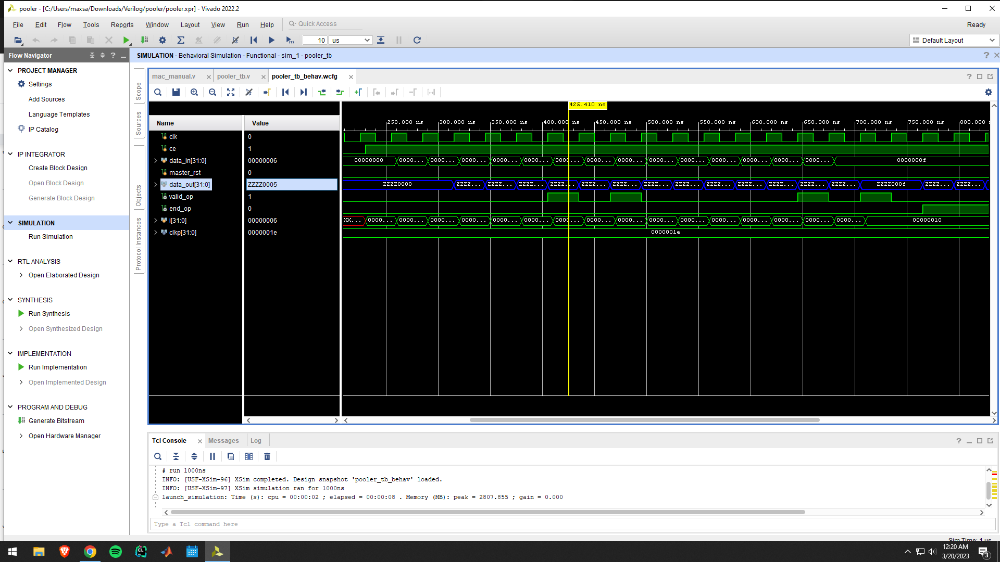

**FLOAT16 Implementation**

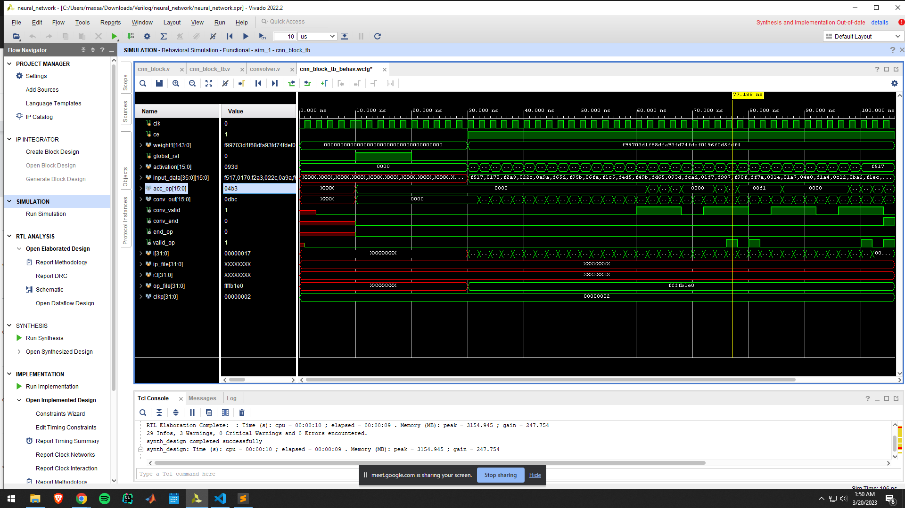

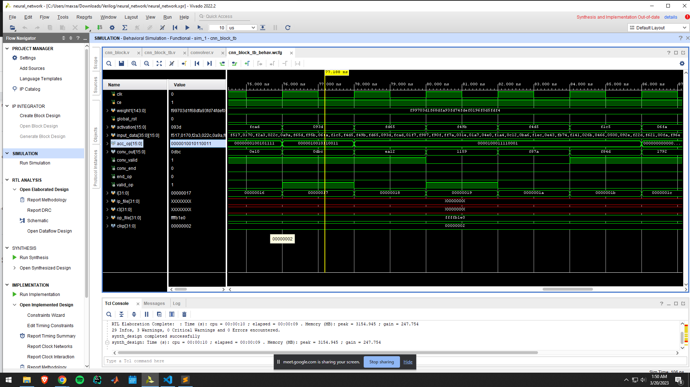

**Schematics**:

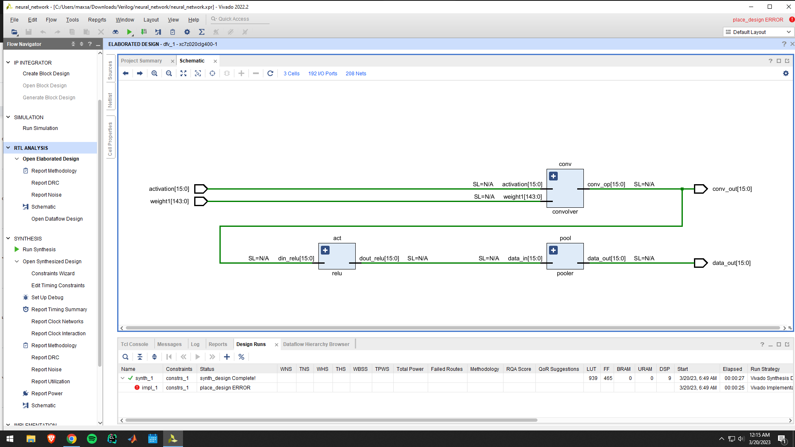

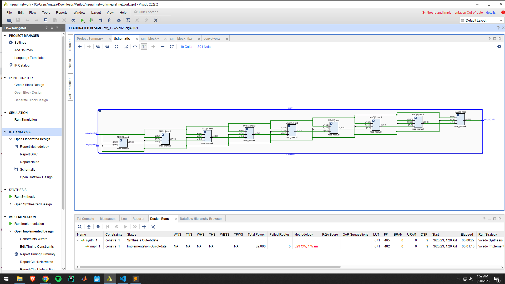

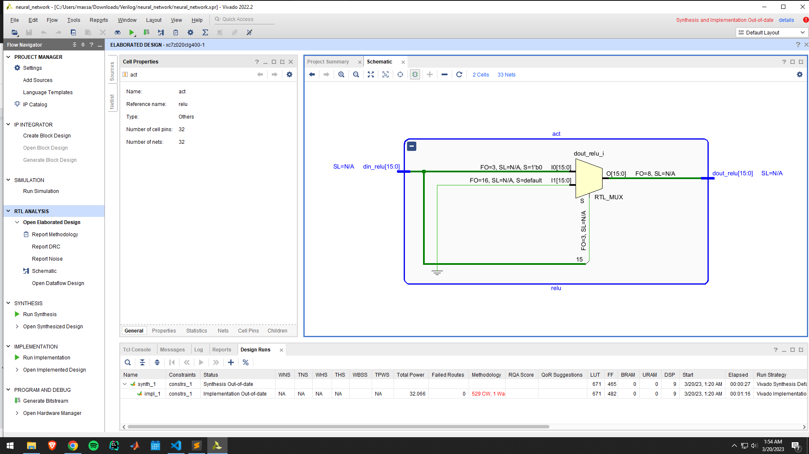

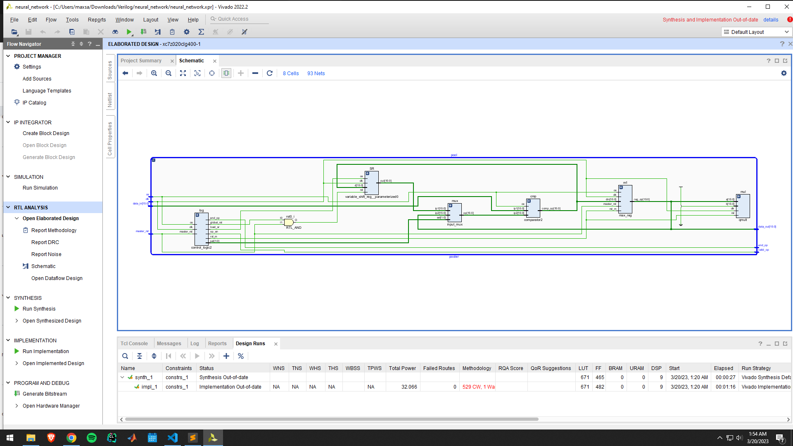
